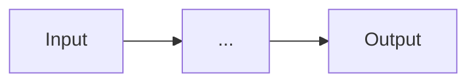

---
id:
  "{ date:YYYYMMDDHHmm }":
title: "{{title}}"
created:
  "{ date:YYYY-MM-DD }":
updated:
  "{ date:YYYY-MM-DD }":
tags:
  - model
  - ml
type: model
status: 🌱 seedling
task_type:
family:
---

# {{title}}

## Core idea

<!-- One sentence: what does this model do and what assumption makes it work? -->


## Key assumptions

- 

## How it works

<!-- Mechanism in 1-3 paragraphs. Link to concept notes for details. -->


## Architecture / Diagram



## Key equations

$$

$$

## Hyperparameters

| Parameter | Role | Typical range |
|-----------|------|---------------|
|           |      |               |

## Strengths

- 

## Limitations

- 

## When to choose it

<!-- In what scenario would you pick this model over alternatives? -->


## Complexity

| Aspect  | Value |
|---------|-------|
| Train   |       |
| Predict |       |
| Memory  |       |

## Code example

```python

```

## Connections

- Based on: [[]]
- Alternatives: [[]]
- Improves upon: [[]]
- Concepts used: [[]]

## References

- 
