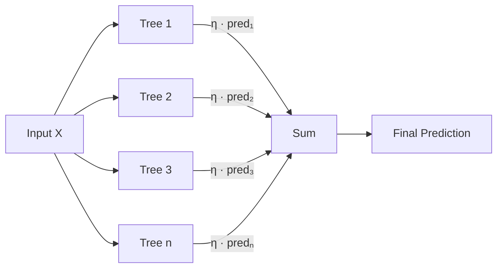

# XGBoost

## Core idea

Gradient-boosted decision trees with regularization: sequentially fits shallow trees to the residual errors of the ensemble, using second-order Taylor expansion for the loss and L1/L2 regularization on tree complexity to prevent overfitting.

## Key assumptions

- Features are tabular (not sequential or spatial)
- Relationships can be captured by axis-aligned splits
- Enough signal in the features to beat noise (boosting amplifies noise if not regularized)

## How it works

Each round adds a tree $f_t$ that minimizes a regularized objective:

$$\mathcal{L}^{(t)} = \sum_{i=1}^n l(y_i, \hat{y}_i^{(t-1)} + f_t(x_i)) + \Omega(f_t)$$

It uses a second-order Taylor expansion of the loss to solve for optimal leaf weights analytically. Trees are grown greedily using a gain criterion that accounts for both fit improvement and tree complexity penalty. Key tricks: column subsampling, histogram-based binning for speed, sparsity-aware splits for missing values.

## Architecture / Diagram



## Key equations

$$\text{Gain} = \frac{1}{2}\left[\frac{G_L^2}{H_L + \lambda} + \frac{G_R^2}{H_R + \lambda} - \frac{(G_L + G_R)^2}{H_L + H_R + \lambda}\right] - \gamma$$

Where $G = \sum g_i$ (sum of gradients), $H = \sum h_i$ (sum of hessians), $\lambda$ = L2 reg, $\gamma$ = min split gain.

## Hyperparameters

| Parameter | Role | Typical range |
|-----------|------|---------------|
| `n_estimators` | Number of boosting rounds | 100–5000 |
| `max_depth` | Tree depth (controls complexity) | 3–8 |
| `learning_rate` (η) | Shrinkage per tree | 0.01–0.3 |
| `subsample` | Row sampling ratio | 0.6–1.0 |
| `colsample_bytree` | Column sampling ratio | 0.5–1.0 |
| `reg_lambda` (λ) | L2 regularization on weights | 0–10 |
| `reg_alpha` (α) | L1 regularization on weights | 0–10 |
| `min_child_weight` | Min sum of hessian in a leaf | 1–10 |
| `gamma` (γ) | Min gain to make a split | 0–5 |

## Strengths

- Excellent out-of-the-box performance on tabular data
- Handles missing values natively (learns best direction for missing)
- Feature importance built-in (gain, cover, frequency)
- Fast training with histogram binning + parallelism
- Regularization prevents overfitting better than vanilla GBM

## Limitations

- Not great for images, text, or sequential data (use NNs)
- Predictions are not smooth (piecewise constant)
- Can overfit with too many rounds and low regularization
- Harder to interpret than a single tree or linear model
- Doesn't extrapolate beyond training data range

## When to choose it

Pick XGBoost when you have structured/tabular data, a moderate number of features, and you want strong performance with minimal preprocessing. It's the default "first serious model" for tabular tasks. Prefer it over neural nets unless you have very large data + GPU budget or non-tabular inputs.

## Complexity

| Aspect  | Value |
|---------|-------|
| Train   | O(n · d · n_trees · max_depth) |
| Predict | O(n_trees · max_depth) per sample |
| Memory  | O(n_trees · leaves) |

## Code example

```python
import xgboost as xgb
from sklearn.model_selection import train_test_split
from sklearn.metrics import roc_auc_score

X_train, X_val, y_train, y_val = train_test_split(X, y, test_size=0.2)

model = xgb.XGBClassifier(
    n_estimators=500,
    max_depth=5,
    learning_rate=0.05,
    subsample=0.8,
    colsample_bytree=0.8,
    reg_lambda=1.0,
    early_stopping_rounds=50,
    eval_metric="auc",
    use_label_encoder=False,
)

model.fit(X_train, y_train, eval_set=[(X_val, y_val)], verbose=50)
print(f"AUC: {roc_auc_score(y_val, model.predict_proba(X_val)[:, 1]):.4f}")
```

## Connections

- Based on: [[Gradient Boosting]], [[Decision Trees]], [[CART]]
- Alternatives: [[LightGBM]], [[CatBoost]], [[Random Forest]]
- Improves upon: [[GBM (Friedman)]]
- Concepts used: [[Bias-Variance Tradeoff]], [[Regularization]], [[Ensemble Methods]]

## References

- Chen & Guestrin (2016) — "XGBoost: A Scalable Tree Boosting System"
- XGBoost docs: https://xgboost.readthedocs.io
